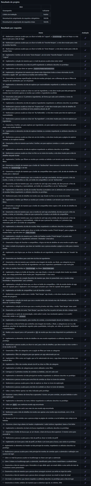

# Recipes App
Projeto da [Trybe](https://www.betrybe.com/) - Bloco 18 - Aplicação de receitas feita com React, utilizando Context API e React Hooks.

## 💻 Projeto

Aplicação de receitas feita em React, com Context API e React Hooks, com foco em dispositivos móveis, em que é possível buscar, filtrar, favoritar e acompanhar o progresso de preparação de receitas e drinks.

<details>
  <summary><strong>🏆 Meu desempenho</strong></summary><br />

  
</details>

## 🚀 Tecnologias
> Este projeto foi desenvolvido com as seguintes tecnologias:

- JavaScript
- React
- Context API
- React Hooks
- Styled Components

## 📌 Habilidades

> Neste projeto, desenvolvi as seguintes habilidades:

- Utilizar a Context API do React para gerenciar estado;
- Utilizar os React Hooks useContext, useState e useEffect;
- Criar React Hooks customizados;
- Estilizar componentes React com Styled Components.

## ⬇️ Instalando dependências

```bash
npm install
``` 

## ⚡ Executando a aplicação

```bash
npm start
``` 

## 🧪 Executando os testes

```bash
npm test
```

## 👨‍💻👩‍💻 Contribuintes
<div>
    <table>
        <tr>
            <td align="center"><a href="https://github.com/julianoboese"><br /><b>Juliano Boese</b></a></td>
            <td align="center"><a href="https://github.com/brennomiliani"><br /><b>Brenno Miliani</b></a></td>
            <td align="center"><a href="https://github.com/victorhsms"><br /><b>Victor Hugo</b></a></td>
            <td align="center"><a href="https://github.com/byancaknorst"><br /><b>Byanca Knorst</b></a></td>
        </tr>
    </table>
</div>

## 💬 Contatos

<div align="center" style="display: inline_block">
  <a href="https://julianoboese.github.io" target="_blank"></a> 
  <a href="https://www.linkedin.com/in/julianoboese" target="_blank"></a> 
  <a href = "mailto:juliano.boese@gmail.com"></a>
</div>

<!-- ## 📄 Licença

Esse projeto está sob licença. Veja o arquivo [LICENÇA](LICENSE.md) para mais detalhes.

[⬆ Voltar ao topo](#nome-do-projeto)<br> -->
